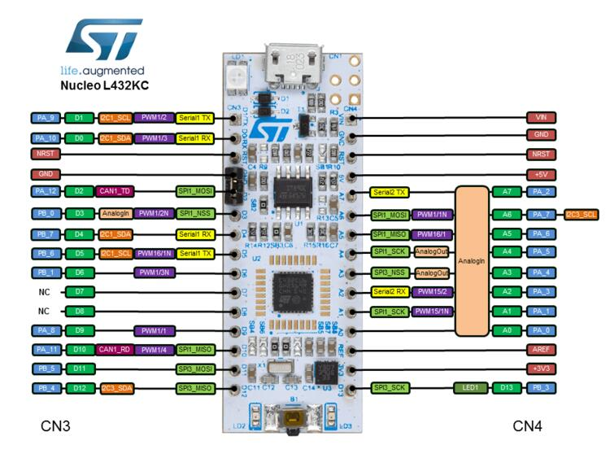
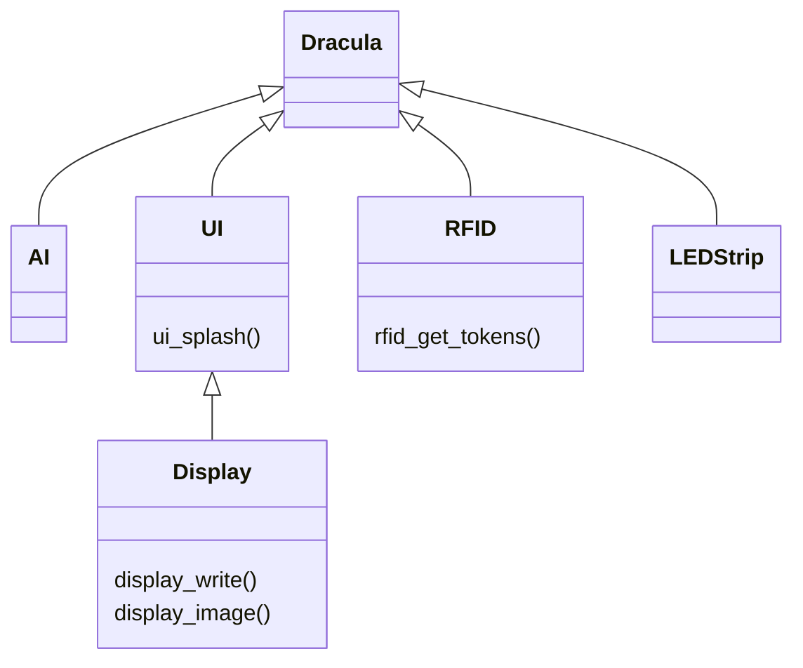
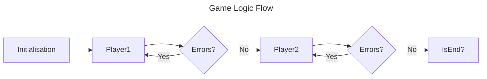

## Dracula

Welcome to the core repository of dracula, an interactive and collaborative
technology enhanced board game of hidden information. In Dracula, players must
race to track down and stake Dracula before they are all eliminated. On each
turn, a player can move to a new room on a castle board, cast light to block
Dracula from moving, throw garlic to detect him, and throw stakes to attack him.
Each board game piece is RFID tagged to be read by RFID readers in the board.
After all players turns, the game's computer uses the RFID information to
automate Dracula's actions and display game information to the players using an
LCD screen and LEDs, that provides an engaging user experience. Will the players
be able to take down Dracula in time?

Contents:
1. [Dracula](#Dracula)
2. [Development Environment](#2-development-environment)
3. [Building & Flashing](#3-building--flashing)
4. [Hardware & BOM](#4-hardware--bom)
5. [Connecting the Board](#5-connecting-the-board)
6. [Project Overview](#6-project-overview)
7. [Repository Structure](#7-repository-structure)
8. [Using the Display](#8-using-the-display)
9. [Additional Resources](#9-additional-resources)

## 2. Development Environment

Only windows and linux are supported (not apple).

Firstly, download the required programs for the development environment:
- [VSCode](https://code.visualstudio.com/download) - Our selected integrated
  development environment.
- [WSL](https://learn.microsoft.com/en-us/windows/wsl/install) - Required for
  running docker on windows machines.
- [Docker](https://www.docker.com/) - Used to support the development
  environment across multiple platforms, and ensures the toolchain is not
  required locally.
- [usbip](https://usbip.sourceforge.net/) - Used to forward usb connections to
  docker in windows wsl development environments.
- VSCode Extensions. Most critically are:
  - [`C/C++`](https://marketplace.visualstudio.com/items?itemName=ms-vscode.cpptools)
    for C syntax highlighting and intellisense.
  - [`Dev Containers`](https://marketplace.visualstudio.com/items?itemName=ms-vscode-remote.remote-containers)
    for supporting docker dev-containers.
  - More are recommended when opening the repository in VSCode.

The microcontroller used in this project is an
[STM32L432KC](https://www.st.com/en/microcontrollers-microprocessors/stm32l432kc.html)
on the [Nucleo-L432KC](https://www.st.com/en/evaluation-tools/nucleo-l432kc.html)
development board. Specifics about these boards are not required, other than the
pinout configuration on the development board for connecting wires together.

To get started, use a micro USB to USB cable to plug the development board into
your computer. If you do not have a USB type A port on your computer, you must
use a dongle adaptor. The device should flash red to indicate it is powered, but
the USB communication chip is not receiving any data.

> [!NOTE]
> Windows users will need to forward USB connections to wsl.
> - Open a command terminal by search for "Command Prompt" or your favourite
>   terminal program.
> - Run `usbipd list` to list the current USB devices.
> - This should reveal a device with a name prefixed with "ST-Link". Note down
>   the matching `BUSID`, that are two numbers separated by a dash.
> - Run `usbipd attach -b <bus_id> --wsl`. For example, for a bus id of "4-1"
>   you would run `usbipd attach -b 4-1 --wsl`. This may require adminstrator
>   permissions. Ensure the bus id is typed correctly, matches the ST-Link
>   device, and the device is plugged in.
> - The usb device should now be forwarded to docker.

Open the repository folder in VSCode, then reopen the folder in the docker 
development container. To do so either click the pop-up
`"Reopen folder in container"` on the bottom right or press `F1`, type
`"Dev Containers: Reopen in Container"` and press enter. This will build the
development container using the VSCode devcontaner specification at
[/.devcontainer/devcontainer.json](.devcontainer/devcontainer.json) and the
corresponding [/.devcontainer/dockerfile](/.devcontainer/dockerfile), and may
take up to 30 minutes to complete depending on download speed. Once completed,
the folder will reopen in the development environment.

## 3. Building & Flashing

This project is built using the
[Zephyr](https://docs.zephyrproject.org/latest/index.html) real time operating
system and development framework. Not only does Zephyr provide an abstraction
layer for interfacing with the microcontroller, it also provides building and
flashing utilities. In this project, building, flashing and other repetitive
tasks are automated using [VSCode
tasks](https://code.visualstudio.com/Docs/editor/tasks). All the tasks are
defined in the [/.vscode/tasks.json](/.vscode/tasks.json) and require the
project to be opened the devcontainer. Note that these tasks call scripts under
[`/scripts`](scripts) that can be run from a command line to support developers
that have a local Zephyr installation and would rather use another environment
such as vim. To run a task, press `F1`, type `"Tasks: Run Task"` and select one
from the drop down list.

- To build the project, run the `"Build"` task.
- To clean the build, run the `"Clean"` task.
- To flash a built project to the microcontroller, run the `"Flash"` task.

## 4. Hardware & BOM

The full bill of materials for the electronics is as follows:

| Component                                | Link                                                                                                                          | #   | Individual Cost                                                                                                                                         | Total Cost |
| ---------------------------------------- | ----------------------------------------------------------------------------------------------------------------------------- | --- | ------------------------------------------------------------------------------------------------------------------------------------------------------- | ---------- |
| Microcontroller                          | [Nucleo-L432KC](https://www.st.com/en/evaluation-tools/nucleo-l432kc.html)                                                    | 1   | [16.27$ (Digikey)](https://www.digikey.com.au/en/products/detail/stmicroelectronics/NUCLEO-L432KC/6132763?s=N4IgTCBcDaIHYFcDGAbApgewAQoCwGYwBrJEAXQF8g) | 16.27$     |
| Display                                  | [Waveshare 2.42inch OLED Module](https://core-electronics.com.au/242inch-oled-display-module-128x64px.html)                   | 1   | [22.60$ (Core Electronics)](https://core-electronics.com.au/242inch-oled-display-module-128x64px.html)                                                  | 22.60$     |
| LED Strip                                | [W2812 RGB LED Strip 2m](https://core-electronics.com.au/digital-rgb-led-strip-120-led-black.html)                            | 1   | [19.60$ (Core Electronics)](https://core-electronics.com.au/digital-rgb-led-strip-120-led-black.html)                                                   | 19.60$     |
| RFID Tags                                | [NTAG213 25mm Coin RFID Tag](https://core-electronics.com.au/ntag213-coin-25mm-white.html)                                    | 16  | [1.49$ (Core Electronics)](https://core-electronics.com.au/ntag213-coin-25mm-white.html)                                                                | 23.84$     |
| RFID Sensor                              | [PiicoDev RFID Module](https://core-electronics.com.au/piicodev-rfid-module.html)                                             | 22  | [8.59$ (Core Electronics) Bulk](https://core-electronics.com.au/piicodev-rfid-module.html)                                                              | 188.98$    |
| RFID I2C Bus 200mm                       | [PiicoDev Cable 200mm](https://core-electronics.com.au/piicodev-cable-200mm.html)                                             | 14  | [1.06$ (Core Electronics)](https://core-electronics.com.au/piicodev-cable-200mm.html)                                                                   | 14.84$     |
| RFID I2C Bus 500mm                       | [PiicoDev Cable 500mm](https://core-electronics.com.au/piicodev-cable-500mm.html)                                             | 6   | [1.4$ (Core Electronics)](https://core-electronics.com.au/piicodev-cable-500mm.html)                                                                    | 8.40$      |
| RFID Sensor I2C Breakout                 | [PiicoDev Adaptor for Breadboards](https://core-electronics.com.au/piicodev-breadboard-adapter.html)                          | 6   | [2.61$ (Core Electronics)](https://core-electronics.com.au/piicodev-breadboard-adapter.html)                                                            | 15.66$     |
| RFID I2C Multiplexer                     | [TCA9548A I2C Multiplexer](https://core-electronics.com.au/tca9548a-i2c-multiplexer.html)                                     | 1   | [13.05$ (Core Electronics)](https://core-electronics.com.au/tca9548a-i2c-multiplexer.html)                                                              | 13.05$     |
| Battery                                  | [LiPo Battery 2000mAh](https://core-electronics.com.au/polymer-lithium-ion-battery-2000mah-38459.html)                        | 1   | [17.55$ (Core Electronics)](https://core-electronics.com.au/polymer-lithium-ion-battery-2000mah-38459.html)                                             | 17.55$     |
| Battery Management 5V Supply             | [SparkFun LiPo Charger/Booster - 5V/1A](https://www.sparkfun.com/products/14411)                                              | 1   | [28.35$ (Core Electronics)](https://core-electronics.com.au/sparkfun-lipo-charger-booster-5v-1a.html)                                                   | 28.35$     |
| 3.3V Stepdown                            | [SparkFun BabyBuck Regulator Breakout - 3.3V](https://www.sparkfun.com/products/18357)                                        | 1   | [7.30$ (Core Electronics)](https://core-electronics.com.au/sparkfun-babybuck-regulator-breakout-3-3v-ap63203.html)                                      | 7.30$      |
| PWM 5V Logic Level Shifter for LED Strip | [Logic Level Converter BiDirectional](https://core-electronics.com.au/logic-level-converter-bidirectional.html)               | 1   | [3.05$ (Core Electronics)](https://core-electronics.com.au/logic-level-converter-bidirectional.html)                                                    | 3.05$      |
| Power Switch                             | [Rocker Switch (SPST)](https://core-electronics.com.au/rocker-switch-spst-round.html)                                         | 1   | [0.85$ (Core Electronics)](https://core-electronics.com.au/rocker-switch-spst-round.html)                                                               | 0.85$      |
| Player Switch                            | [16mm Panel Mount Momentary Pushbutton - Red](https://core-electronics.com.au/16mm-panel-mount-momentary-pushbutton-red.html) | 1   | [1.91$ (Core Electronics)](https://core-electronics.com.au/16mm-panel-mount-momentary-pushbutton-red.html)                                              | 1.91$      |
| Male-Female Jumpers                      | [Jumper Wire 20cm Ribbon M/F](https://core-electronics.com.au/male-female-jumper-wire-40-20cm.html)                           | 1   | [3.95$ (Core Electronics)](https://core-electronics.com.au/male-female-jumper-wire-40-20cm.html)                                                        | 3.95$      |
| Male-Male Jumpers                        | [Male to Male Jumper Wires](https://core-electronics.com.au/professional-male-to-male-jumper-wires-40-x-20cm.html)            | 1   | [7.30$ (Core Electronics)](https://core-electronics.com.au/professional-male-to-male-jumper-wires-40-x-20cm.html)                                       | 7.30$      |
| Male Headers                             | [Male Headers 2.56mm](https://core-electronics.com.au/header-male-pin-01x20.html)                                             | 2   | [0.35$ (Core Electronics)](https://core-electronics.com.au/header-male-pin-01x20.html)                                                                  | 0.70$      |
| Breadboard                               | [Breadboard - Mini Modular (Red)](https://www.sparkfun.com/products/12044)                                                    | 2   | [2.75$ (Core Electronics)](https://core-electronics.com.au/170-tie-point-mini-red-solderless-breadboard.html)                                           | 5.5$       |
| Shipping                                 |                                                                                                                               |     |                                                                                                                                                         | 10.20$     |
| Total Cost                               |                                                                                                                               |     |                                                                                                                                                         | 409.90$    |

The main microcontroller is an [STM32L432KC](https://www.st.com/en/microcontrollers-microprocessors/stm32l432kc.html)
on the [Nucleo-L432KC](https://www.st.com/en/evaluation-tools/nucleo-l432kc.html) used as the main board for the system.

## 5. Connecting the Board

The development board pins can be seen below:

<center>
  
</center>

> [!note]
> The black button opposite the micro USB port is the reset button.

### 5.1 Display

Connect the following:

| Wire Colour | Display Function | Port | Configured As | Board Pin |
| ----------- | ---------------- | ---- | ------------- | --------- |
| Blue        | Data In          | PA7  | SPI1 MOSI     | A6        |
| Yellow      | Clock            | PA1  | SPI SCK       | A1        |
| Orange      | Chip Select      | PB0  | SPI_NSS       | D3        |
| Green       | Data / Command   | PA4  | GPIO          | A3        |
| White       | Reset            | PA0  | GPIO          | A0        |
| Red         | Power            | -    | 3.3V          | Vin       |
| Black       | Ground           | -    | 0V            | GND       |

### 5.2 RFID

Connect the following:

| Wire Colour | I2C Function | Port | Configured As | Board Pin |
| ----------- | ------------ | ---- | ------------- | --------- |
| Blue        | Serial data  | PB7  | I2C1 SDA      | D4        |
| Yellow      | Clock        | PB6  | I2C1 SCL      | D5        |
| Red         | Power        | -    | 3.3V          | 3V3       |
| Black       | Ground       | -    | 0V            | GND       |

In the [`app.overlay`](/dracula/app.overlay) device tree, configure the `rfid`
nodes in the `&i2c1` bus. For example:

```dts
&i2c1 {
	status = "okay";

	rfid@2c {
		compatible = "nxp,mfrc522";
		reg = <0x2c>;
		status = "okay";
		bearsink,room = "NHALL";
	};
};
```

Make sure all `status`es are `"okay"`, and change the `reg = <0x2c>;` addresses
to match your readers, if necessary.

> [!note]
> Make sure readers on the same bus have different I<sup>2</sup>C addresses from
> each other; i.e. set the dip switches in different positions. Because the
> PiicoDev modules support only 4 addresses, 4 is the maximum number of readers
> per bus.

Change the `bearsink,room` property to the [`enum RoomName`](/dracula/src/room.h)
value corresponding to the room each reader represents

## 6. Project Overview

In Dracula, there five top level components:
- **RFID Sensors** - The driver provides the information about each sensor and
  any tokens placed on top of them. This is implemented at [`rfid.cpp` /
  `rfid.h`](/dracula/src/rfid.cpp). The RFID library at
  [`MFRC522_I2C.cpp`](/dracula/src/MFRC522_I2C.cpp) is from
  [arozcan/MFRC522-I2C-Library](https://github.com/arozcan/MFRC522-I2C-Library)
  and has been adapted to use Zephyr APIs.
- **LED Strip** - Used to display user.
- **OLED Display** - Provides complex information to the users and information
  unable to be conveyed by the LEDs or through game mechanics. Implemented by
  [`display.c` / `display.h`](/dracula/src/display.h).
- **Dracula AI** - Determines the move that Dracula makes.
- **Game Logic** - Combines the other components together with game logic
  including condition checks and logical game flow. Implemented by [`dracula.h`
  / `dracula.c`](/dracula/src/dracula.h).

The entrypoint to the game logic is located at
[`dracula/src/main.c`](dracula/src/main.c).





## 7. Repository Structure

- [`.devcontainer`](/.devcontainer)
  - [`devcontainer.json`](/.devcontainer/devcontainer.json) - Development container configuration file.
  - [`dockerfile`](/.devcontainer/dockerfile) - Dockerfile defining the zephyr development environment.
  - [`entrypoint.sh`](/.devcontainer/entrypoint.sh) - Script run in every terminal connecting to the devcontainer.
- [`.vscode`](/.vscode)
  - [`.vscode/c_cpp_properties.json`](/.vscode/c_cpp_properties.json) - Intellisense configuration for zephyr files and source code.
  - [`.vscode/extensions.json`](/.vscode/extensions.json) - Extensions required to install for VSCode, to support the development container and C intellisense.
  - [`.vscode/launch.json`](/.vscode/launch.json) - Debugging configurations when pressing F5.
  - [`.vscode/settings.json`](/.vscode/settings.json) - General VSCode project settings.
  - [`.vscode/tasks.json`](/.vscode/tasks.json) - Terminal commands to run for repetitive actions, such as building and flashing.
- [`assets`](/assets) - Resources files that are not including directly in code.
  - [`display`](/assets/display) - PNG files to convert to memory buffers for the display driver.
- [`dracula`](/dracula/) - Project files and source code.
  - [`prj.conf`](/dracula/prj.conf) - [KConfig](https://docs.zephyrproject.org/latest/build/kconfig/index.html) file that defines the enabled peripherals and microcontroller options. All available options can be found [here](https://docs.zephyrproject.org/2.7.5/reference/kconfig/index-all.html).
  - [`CMakeLists.txt`](/dracula/CMakeLists.txt) - CMake file defining the source files (globbed from [`src`](/dracula/src)) and zephyr as a project dependancy.
  - [`app.overlay`](/dracula/app.overlay) - A [DeviceTree](https://docs.zephyrproject.org/latest/build/dts/intro-scope-purpose.html) overlay file that defines and configures the microcontroller hardware including SPI, I2C, GPIO and PWM, to communicate with display, rfid and led strip.
  - [`src`](/dracula/src) - Source code for the project.
    - [`ai.c`](/dracula/src/ai.c) / [`ai.h`](/dracula/src/ai.h) - Implementation of the dracula AI.
    - [`display.c`](/dracula/src/display.c) / [`display.h`](/dracula/src/display.h) - Driver for the [OLED display module](https://core-electronics.com.au/242inch-oled-display-module-128x64px.html) that uses the [`SSD1309`](https://www.hpinfotech.ro/SSD1309.pdf) IC interface.
    - [`dracula.c`](/dracula/src/dracula.c) / [`dracula.h`](/dracula/src/dracula.h) - Core game logic implementation.
    - [`font.c`](/dracula/src/font.c) / [`font.h`](/dracula/src/font.h) - Interface for displaying strings on the display.
    - [`MRFC522_I2C.cpp`](/dracula/src/MRFC522_I2C.c) / [`MRFC522_I2C.h`](/dracula/src/MRFC522_I2C.h) - Library for interfacing with the [RFID modules](https://core-electronics.com.au/piicodev-rfid-module.html)
    - [`rfid.cpp`](/dracula/src/rfid.cpp) / [`rfid.h`](/dracula/src/rfid.h) - Driver coordinating the multiple RFID modules and keeping track of token locations
    - [`room.c`](/dracula/src/room.c) / [`room.h`](/dracula/src/room.h) -
    - [`ui.c`](/dracula/src/ui.c) / [`ui.h`](/dracula/src/ui.h) - User interface implementation for Dracula including splash screen, game events, and error conditions built on the display driver.
- [`prototypes`](/prototypes) - Game logic designs in other languages.
- [`scripts`](/scripts)
  - [`build.sh`](/scripts/build.sh) - Builds the source file.
  - [`clean.sh`](/scripts/clean.sh) - Deletes the build folder of the last compilation.
  - [`convert_png.py`](/scripts/convert_png.py) - Converts PNG files to memory buffers able to be written to the display in code.
  - [`flash.sh`](/scripts/flash.sh) - Flashes the board with the most recent build.
  - [`format.sh`](/scripts/format.sh) - Autoformats source files.
  - [`jlink_postinit.sh`](/scripts/jlink_postinit.sh) -
  - [`screen.sh`](/scripts/screen.sh) - Connects to the serial port on the development board to monitor system logs.
  - [`source_zephyr.sh`](/scripts/source_zephyr.sh) - Initialises zephyr environment variables from the SDK location.
  - [`usbip_wsl_attach.sh`](/scripts/usbip_wsl_attach.sh) - Automated script to detect and attach the to microcontroller communications.
  - [`west_update.sh`](/scripts/west_update.sh) -
- [`.gitattributes`](/.gitattributes) - Ensures source files and bash scripts maintain linux LF line endings.
- [`.gitignore`](/.gitignore) - Ignore file for C and python to prevent build files being committed to git.
- [`README.md`](/README.md) - Project documentation.

## 8. Using the Display

The display has 8 rows, each with 128 columns. Each row is 8 pixels tall, and
each of the 8 bits in a byte written to the display sets the 8 pixel states from
LSB to MSH at a given row and column.

Since creating data buffers for such a structure is difficult by hand, A python
script is supplied under [`scripts/convert_png.py`](/scripts/convert_png.py)
that takes a png file and produces a memory buffer usable with the
[`dracula/src/display.h`](/dracula/src/display.h) API.

The first step is to design a png file suitable for the display. The PNG
requires:
- The maximum pixel dimensions must be 64 pixels high, 128 pixels wide.
- The height of the png must be a multiple of 8, since the display writes pixel
  data in sets of 8.
- Since the OLED pixels can only be on or off, only pure black white images
  should be converted.

> [!warning]
> The produced buffer should not be stored in global static memory, that would
> use up valuable RAM. Instead, each buffer should be defined in it's own
> function, and therefore retrieved from program memory when required.

## 9. Additional Resources

- Prototypes for the game logic and the AI may be found in
  [`prototypes`](/prototypes/)
- [Weekly Notes](/docs/notes/)
- [Github Wiki](https://github.com/alegs-a/bears-ink/wiki)
