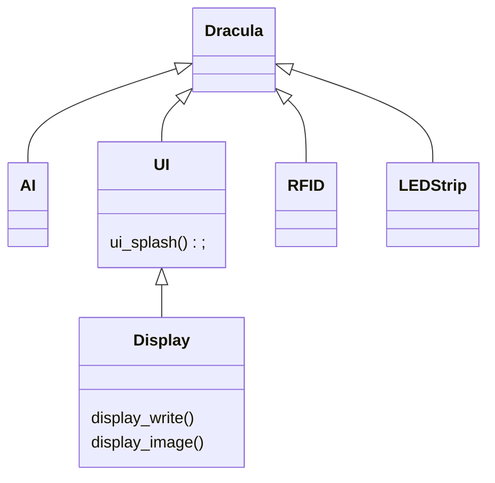

## Dracula

Welcome to the core repository of dracula, an interactive and collaborative
technology enhanced board game of hidden information. In Dracula, players must
race to track down and stake Dracula before they are all eliminated. On each
turn, a player can move to a new room on a castle board, cast light to block
Dracula from moving, throw garlic to detect him, and throw stakes to attack him.
Each board game piece is RFID tagged to be read by RFID readers in the board.
After all players turns, the game's computer uses the RFID information to
automate Dracula's actions and display game information to the players using an
LCD screen and LEDs, that provides an engaging user experience. Will the players
be able to take down Dracula in time?

## Development Environment

Only windows and linux are supported (not apple).

Firstly, download the required programs for the development environment:
- [VSCode](https://code.visualstudio.com/download) - Our selected integrated
  development environment.
- [WSL](https://learn.microsoft.com/en-us/windows/wsl/install) - Required for
  running docker on windows machines.
- [Docker](https://www.docker.com/) - Used to support the development
  environment across multiple platforms, and ensures the toolchain is not
  required locally.
- [usbip](https://usbip.sourceforge.net/) - Used to forward usb connections to
  docker in windows wsl development environments.
- VSCode Extensions. Most critically are:
  - [`C/C++`](https://marketplace.visualstudio.com/items?itemName=ms-vscode.cpptools)
    for C syntax highlighting and intellisense.
  - [`Dev Containers`](https://marketplace.visualstudio.com/items?itemName=ms-vscode-remote.remote-containers)
    for supporting docker dev-containers.
  - More are recommended when opening the repository in VSCode.

The microcontroller used in this project is an
[STM32L432KC](https://www.st.com/en/microcontrollers-microprocessors/stm32l432kc.html)
on the [Nucleo-L432KC](https://www.st.com/en/evaluation-tools/nucleo-l432kc.html)
development board. Specifics about these boards are not required, other than the
pinout configuration on the development board for connecting wires together.

To get started, use a micro USB to USB cable to plug the development board into
your computer. If you do not have a USB type A port on your computer, you must
use a dongle adaptor. The device should flash red to indicate it is powered, but
the USB communication chip is not receiving any data.

> [!NOTE]
> Windows users will need to forward USB connections to wsl.
> - Open a command terminal by search for "Command Prompt" or your favourite
>   terminal program.
> - Run `usbipd list` to list the current USB devices.
> - This should reveal a device with a name prefixed with "ST-Link". Note down
>   the matching `BUSID`, that are two numbers separated by a dash.
> - Run `usbipd attach -b <bus_id> --wsl`. For example, for a bus id of "4-1"
>   you would run `usbipd attach -b 4-1 --wsl`. This may require adminstrator
>   permissions. Ensure the bus id is typed correctly, matches the ST-Link
>   device, and the device is plugged in.
> - The usb device should now be forwarded to docker.

Open the repository folder in VSCode, then reopen the folder in the docker 
development container. To do so either click the pop-up
`"Reopen folder in container"` on the bottom right or press `F1`, type
`"Dev Containers: Reopen in Container"` and press enter. This will build the
development container using the VSCode devcontaner specification at
[/.devcontainer/devcontainer.json](.devcontainer/devcontainer.json) and the
corresponding [/.devcontainer/dockerfile](/.devcontainer/dockerfile), and may
take up to 30 minutes to complete depending on download speed. Once completed,
the folder will reopen in the development environment.


## Building & Flashing

This project is built using the
[Zephyr](https://docs.zephyrproject.org/latest/index.html) real time operating
system and development framework. Not only does Zephyr provide an abstraction
layer for interfacing with the microcontroller, it also provides building and
flashing utilities. In this project, building, flashing and other repetitive
tasks are automated using [VSCode
tasks](https://code.visualstudio.com/Docs/editor/tasks). All the tasks are
defined in the [/.vscode/tasks.json](/.vscode/tasks.json), and require the
project to be opened the devcontainer. Note that these tasks call scripts under
[`/scripts`](scripts) that can be run from a command line. This is to support
development for developers that have a local Zephyr installation and would
rather use another development environment such as vim. To run a task, press
`F1`, type `"Tasks: Run Task"` and select one from the drop down list.

- To build the project, run the `"Build"` task.
- To clean the build, run the `"Clean"` task.
- To flash a built project to the microcontroller, run the `"Flash"` task.

## Connecting the Board

The development board pins can be seen below:

<center>
  
</center>

> [!note]
> The black button opposite the micro USB port is the reset button.

Connect the following:
- Display

| Wire Colour | Display Function | Port | Configured As | Board Pin |
| ----------- | ---------------- | ---- | ------------- | --------- |
| Blue        | Data In          | PA7  | SPI1 MOSI     | A6        |
| Yellow      | Clock            | PA1  | SPI SCK       | A1        |
| Orange      | Chip Select      | PB0  | SPI_NSS       | D3        |
| Green       | Data / Command   | PA4  | GPIO          | A3        |
| White       | Reset            | PA0  | GPIO          | A0        |
| Red         | Power            | -    | 3.3V          | Vin       |
| Black       | Ground           | -    | 0V            | GND       |

## Project Overview

In Dracula, there five top level components:
- **RFID Sensors** - The driver provides the information about each sensor
  and any tokens placed on top of them.
- **LED Strip** - Used to display user.
- **OLED Display** - Provides complex information to the users and information
  unable to be conveyed by the LEDs or through game mechanics.
- **Dracula AI** - Determines the move that Dracula makes.
- **Game Logic** - Combines the other components together with game logic
  including condition checks and logical game flow.



```mermaid
---
title: Game Logic Flow
---
flowchart
  Initialisation --> P1[Player1]
  P1 --> A{Errors?}
  A -->|Yes| P1
  A -->|No| P2[Player2]
  P2 --> A{Errors?}
  A -->|Yes| P2
  A -->|No| Check[IsEnd?]
  Check -->|No|
```

## File Structure

The main code project is located in [`dracula`](/dracula/).
- The entrypoint to the game logic is located at [`dracula/src/main.c`](dracula/src/main.c).
- The game logic is handled by [`dracula.h` / `dracula.c`](/dracula/src/dracula.h)
- The display implementation is at [`display.c` / `display.h`](/dracula/src/display.h)
- The RFID implementation is at [`rfid.cpp` / `rfid.h`](/dracula/src/rfid.cpp)
  - The RFID library at [`MFRC522_I2C.cpp`](/dracula/src/MFRC522_I2C.cpp) is from <https://github.com/arozcan/MFRC522-I2C-Library>, and has been adapted to use Zephyr APIs

Additionally, prototypes for the game logic and the AI may be found in [`prototypes`](/prototypes/)

## Using the Display

## Also See

- [Weekly Notes](/docs/notes/)
- [Github Wiki](https://github.com/alegs-a/bears-ink/wiki)
